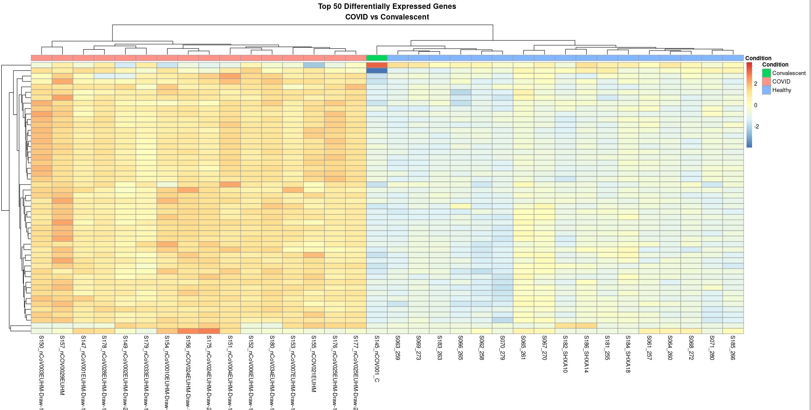

# Transcriptomic Analysis of Human COVID-19 Infection Using RNA-seq and DESeq2

## Project Overview

This project performs differential gene expression analysis of human RNA-seq data comparing **COVID-19 infected samples vs healthy controls**.

The analysis uses the publicly available GEO dataset:

**GSE152418 – Human COVID-19 vs Healthy RNA-seq Dataset**

The workflow identifies differentially expressed genes (DEGs) and performs visualization and functional interpretation using standard RNA-seq bioinformatics approaches.

---

## Objectives

- Perform RNA-seq count data preprocessing
- Analyze differential gene expression using DESeq2
- Identify upregulated and downregulated genes
- Visualize expression differences between COVID-19 and healthy samples
- Generate PCA, MA plot, Volcano plot, and Heatmap visualizations
- Perform functional enrichment analysis

---

## Dataset

**Source:** Gene Expression Omnibus (GEO)

**Accession:** GSE152418

**Organism:** Homo sapiens

**Experimental Groups:**

| Group | Description |
|---|---|
| COVID-19 | SARS-CoV-2 infected samples |
# Software and Packages

## Programming Language

- R

## Bioconductor Packages

- DESeq2
- pheatmap

## Visualization Packages

- ggplot2

---

# Results and Visualizations

## PCA Plot

Principal Component Analysis (PCA) shows sample clustering based on global gene expression patterns.

## MA Plot

MA plot represents the relationship between mean expression and log fold change.

## Volcano Plot

Volcano plot highlights statistically significant differentially expressed genes.

.jpg)

## Heatmap

Heatmap displays expression patterns of significant genes across samples.

## GO Biological Enrichment

Gene Ontology enrichment analysis identifies biological processes associated with differentially expressed genes.

---

# Key Skills Demonstrated

- RNA-seq Data Analysis
- Transcriptomics
- Differential Gene Expression Analysis
- DESeq2 Workflow
- R Programming
- Biological Data Visualization
- Functional Enrichment Analysis
- Reproducible Bioinformatics Workflow

---

# Author

**Sudharshini Kannan**

Computational Biology | Bioinformatics | NGS Data Analysis

| Healthy | Control samples |

---
